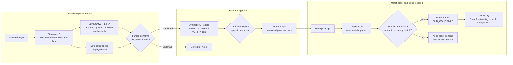
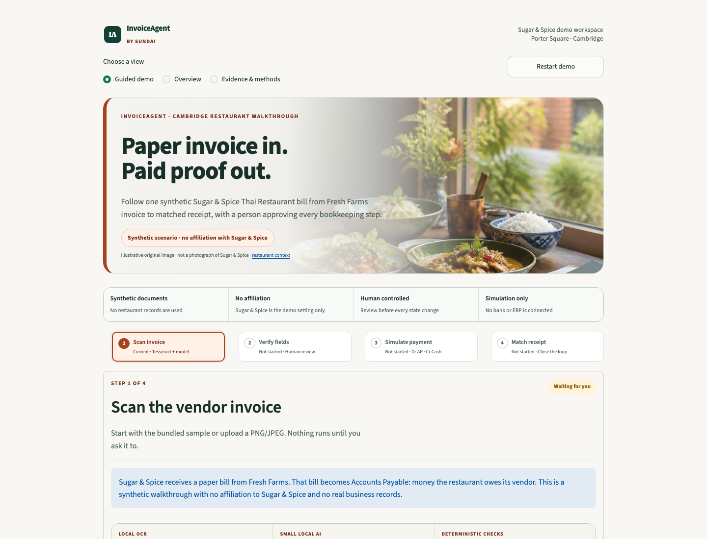

# InvoiceAgent

**From a paper invoice to matched payment proof—locally, visibly, and with a human in control.**

## Situation

Small and medium-sized businesses still receive paper invoices and receipts. Someone must capture the numbers, remember what is owed, and match each payment to its proof. A missed or mistyped document can leave the books out of balance.

For a restaurant, the problem is also operational: when supplier bills exceed the cash available today, paying only the oldest invoice can leave the kitchen without essential produce or meat. The owner needs clear records, safe priorities, and proof—not another chatbot.

## Task & Action

We built a small, local-first document workflow with honest boundaries:

- **Tesseract 5 OCR** runs locally and returns every word, confidence, and normalized box.
- **Ryan Nie's supervised LayoutLMv3 + LoRA small document specialist**—the demo's SLM component—proposes the invoice-number token only. It does not perform OCR, extract the invoice total, read the receipt, rank suppliers, or choose payments.
- **Deterministic rules** ground the displayed invoice total and parse receipt supplier, invoice number, amount, currency, paid date, and receipt ID.
- **Human gates and a batch verifier** require explicit document confirmation and payment approval; uncertainty fails closed.
- **ProcureGym** applies approved actions to a seeded restaurant simulation so the team can measure cash, inventory runway, fees, and supplier outcomes without touching a real system.
- **An RL-ready receipt reward** scores exact proof as `+10`, safe review as `-1`, and unsafe acceptance as `-25`. No receipt policy or model was trained with this signal.
- **A guided Streamlit UI** keeps the business story simple while exposing real code and evidence for engineers. The same app ships in a Docker container for deployment.

The recording path is four steps:

1. **Read invoice.** Use the bundled Fresh Farms PNG or upload PNG/JPEG. Tesseract exposes every OCR token; the LayoutLMv3 specialist proposes `FF-10482`; a separate rule grounds the total.
2. **Confirm and plan.** A person must **CONFIRM**, **CORRECT**, or **REJECT** before the synthetic AP lookup opens. The deterministic policy explains **PAY / DEFER / VERIFY** priorities.
3. **Approve simulated payment.** The verifier checks the complete batch, then one explicit click advances ProcureGym. Nothing reaches a bank, ERP, or real accounting ledger.
4. **Verify receipt.** Tesseract plus deterministic receipt rules compare exact proof. A valid receipt changes Fresh Farms to `PAID_CONFIRMED` without deducting cash again.



### Team

| Member | Background and InvoiceAgent responsibility |
|---|---|
| [Sasa Phanitsombat](https://www.linkedin.com/in/sasakorn-p/) | AI product and evaluation leader with 10+ years across business and technology and an MIT Sloan background. Shaped the restaurant use case and co-owns ProcureGym, the demo, and evaluation proof. |
| [Ryan Nie](https://www.linkedin.com/in/ryanznie/) | Machine-learning practitioner and researcher with work spanning automated data quality and medical imaging. Created the LayoutLMv3 invoice-number asset and co-owns specialist extraction, routing, governance, and demo integration. |
| [David Lee](https://www.linkedin.com/in/authordavidlee/) / `@cheezburgerz` | AI builder and author with Boston University study across computer science and neuroscience. Co-owns OCR/document ingestion, the Router Lab, and demo integration. |
| [Dillon Johnson](https://www.linkedin.com/in/dillonqjohnson/) | Builder at the intersection of art and technology with MIT Sloan and Carnegie Mellon experience. Co-owns the document gate, recommendation governance, Router Lab, and demo integration. |
| [Wilson Wu](https://www.linkedin.com/in/wilson1wu/) / `@skylarwooster` | AI, finance, and product builder with a Duke MBA and Georgia Tech MS in Computer Science. |

### Build ownership

| Category | Named owners |
|---|---|
| C0 — Contracts and fixtures | Wilson / `@skylarwooster` |
| C1 — OCR and ingestion | David / `@cheezburgerz`, Ryan Nie, Dillon |
| C2 — Specialist and document gate | Ryan Nie, Dillon |
| C3 — Lookup and restaurant state | Wilson / `@skylarwooster` |
| C4 — Recommendation and governance | Ryan Nie, Dillon |
| C5 — ProcureGym and baselines | Sasa P, Wilson / `@skylarwooster` |
| C6 — Contextual-bandit Router Lab | David / `@cheezburgerz`, Ryan Nie, Dillon |
| C7 — UI and deployment | Wilson / `@skylarwooster`, Sasa P, Ryan Nie, Dillon, David / `@cheezburgerz` |
| C8 — Evaluation and presentation proof | Sasa P |

Wilson is assembling the end-to-end demo for the deadline. Named owners retain review and sign-off, and compatible teammate work can merge through pull requests. The complete [PRD](docs/PRD.md) defines the interfaces, rewards, safety gates, acceptance criteria, and claims.

## Result

We shipped InvoiceAgent as a controlled Accounts Payable demonstration. It follows one supplier bill from scan to matched payment proof, shows every source of evidence, and keeps a person at each consequential boundary.

The presentation uses [Sugar & Spice Thai Restaurant in Cambridge](https://sugarspices.com/about) as its restaurant persona. **There is no affiliation.** Every invoice, receipt, supplier, amount, cash balance, recommendation, and action is synthetic; the project does not represent a real Sugar & Spice transaction.

The locked scenario begins with **$5,000 cash** and **$6,200 of supplier obligations**. The approved simulation pays Fresh Farms and Prime Foods for $4,000 total. After Fresh Farms receipt proof, **Done — view AP history** opens this exact dashboard:

| Exact dashboard category | Synthetic records |
|---|---|
| **Open invoices (2)** | PackRight `PR-15007` · $1,500 · DEFER; CleanPro `CP-70019` · $700 · VERIFY |
| **Paid · awaiting proof (1)** | Prime Foods `PF-25031` · $2,500 · `SIMULATED_PAYMENT_APPROVED` |
| **Completed (1)** | Fresh Farms `FF-10482` · $1,500 · `PAID_CONFIRMED` with receipt `RCPT-FF-10482` |

The approved batch is interpreted as **Dr Accounts Payable—Fresh Farms $1,500 + Dr Accounts Payable—Prime Foods $2,500 / Cr Cash $4,000** once. It is a simulation, not a real general-ledger posting. Fresh Farms receipt confirmation adds proof and changes status only: cash remains $1,000 and the second cash impact is **$0**. Prime Foods remains paid in the simulation but awaiting proof.

This supports **working-capital discipline** by putting cash, supplier obligations, due dates, operational inventory runway, and proof status in one view. It is not a full net-working-capital calculation. Formal net working capital requires all current assets minus all current liabilities; Accounts Receivable, balance-sheet inventory valuation, and other current assets and liabilities are outside this demo.

### Live demo

> **[Open the temporary public InvoiceAgent demo](https://conflicts-understand-rings-logged.trycloudflare.com)**
>
> Verified responding on 30 August 2026. This is a public, unauthenticated Cloudflare Quick Tunnel, not permanent hosting. Its URL can expire, the host Mac must stay awake, and only synthetic documents may be uploaded.

### Web app preview



The default screen is one guided path: **Read invoice → Confirm and plan → Approve simulation → Match receipt → View AP history**. Every OCR word, box, confidence, business label, and source remains inspectable. Non-technical viewers get the short story; engineers can expand **Technical evidence** to inspect code paths, raw OCR, provenance, model version, latency, scores, hashes, verifier checks, reward output, and deployment details.

The in-app restaurant hero at [`invoiceagent-restaurant-hero.jpg`](data/procureagent/assets/invoiceagent-restaurant-hero.jpg) is an original generated illustration created for this demo; its [provenance is committed beside it](data/procureagent/assets/invoiceagent-restaurant-hero.provenance.json). It is not a photograph of Sugar & Spice, its restaurant, or its staff, and no affiliation is implied.

### Tech stack: what is AI—and what is not

| Part | What runs | Honest boundary |
|---|---|---|
| Invoice OCR | Tesseract 5 | Local OCR, not a language model |
| Invoice number | [`ryanznie/layoutlmv3-lora-invoice-number`](https://huggingface.co/ryanznie/layoutlmv3-lora-invoice-number) | Supervised LayoutLMv3 + LoRA small document specialist; the SLM role is invoice number only |
| Invoice amount | Tesseract + deterministic total-anchor rule | Grounded in OCR; never attributed to LayoutLMv3 |
| Restaurant and payable details | Immutable synthetic lookup | Amount owed, due date, inventory runway, and criticality appear only after identity confirmation |
| Payment order | Criticality-Aware Greedy v1 | Deterministic P0 policy, not a trained RL policy |
| Safety | Batch verifier + explicit operator choice | Nothing changes before approval |
| Consequence | Seeded ProcureGym | Simulated Dr AP / Cr Cash interpretation; no bank, ERP, or real ledger connection |
| Receipt reading | Tesseract + deterministic parser and proof gate | Not LayoutLMv3; proof changes status only and never deducts cash twice |
| Receipt reward | Deterministic `+10 / -1 / -25` evaluator | RL-ready signal; no receipt model or policy was trained |
| Router Lab | Constrained contextual-bandit experiment | P1 development lab; no improvement claim without held-out evidence |
| Interface and deployment | Streamlit + Docker | Product shell and runtime, not AI |

## Captured real-model proof

On the committed synthetic Fresh Farms invoice, a real local run selected the OCR token `FF-10482` and matched the expected value exactly. Inference took **228.9 ms on Apple MPS**. The entity score was below the frozen 0.80 auto-confirm threshold, so the document gate correctly requested operator review even though the model and rule agreed.

This is a one-document smoke test, not an aggregate accuracy claim. The evidence is in [`model_smoke_v1.json`](data/procureagent/eval/model_smoke_v1.json). The pinned adapter revision is `7dc28f5a3b14aa100ba432ee1b0a6cac6c7b2c5c`; the base-model revision is `cfbbbff0762e6aab37086fdd4739ad14fe7d5db4`.

### Router Lab checkpoint

C6 fits a small tabular contextual bandit for invoice-identity routing only. On seven synthetic development rows, it produced **4 correct automatic identities / 0 wrong automatic accepts / 3 reviews**, with average reward `4.6621`. The fixed gate produced **3 / 0 / 4**, average `2.9029`; always-review produced **0 / 0 / 7**, average `-2.3179`.

All seven development context bins also occur in training, and no frozen test was evaluated. This is a within-bin development result—not evidence of generalization, live-upload accuracy, supplier-ranking quality, or payment-action quality.

## Run the recording demo

Ryan—or any teammate with the prerequisites—can run the same web app from a clean clone. No API key is required for the bundled demo.

Requirements:

- Python 3.12
- Tesseract 5
- Internet access on the first run to download the pinned base model and adapter

On macOS with Homebrew:

```bash
brew install python@3.12 tesseract
git clone https://github.com/sasap91/invoiceagent.git
cd invoiceagent
python3.12 -m venv .venv-model
.venv-model/bin/pip install -e ".[demo,test,model]"
./scripts/run_demo.sh
```

Open <http://127.0.0.1:8501> and follow: **Read invoice → Confirm and plan → Approve simulation → Match receipt → Done — view AP history**. The first run downloads model files, so warm it once on reliable internet before presenting.

To use Ryan's adapter from a local checkout instead of downloading it from Hugging Face, set the model path before launching. A blank revision means “use this local checkout”; the public evidence panel shows only the directory name, not the absolute path.

```bash
export INVOICEAGENT_ADAPTER_MODEL=/path/to/layoutlmv3-lora-invoice-number
export INVOICEAGENT_ADAPTER_REVISION=
./scripts/run_demo.sh
```

To expose the running Mac through a new temporary Cloudflare URL:

```bash
brew install cloudflared
./scripts/run_demo.sh --public
```

Keep that terminal open. The printed `trycloudflare.com` URL is public and unauthenticated, changes on restart, and has no uptime guarantee. The Mac must remain awake. Use synthetic fixtures only; never upload confidential invoices.

### Recording fixtures

- [`fresh_farms_invoice.png`](data/procureagent/assets/fresh_farms_invoice.png)
- [`fresh_farms_payment_receipt.png`](data/procureagent/assets/fresh_farms_payment_receipt.png)
- [`receipt_provenance.json`](data/procureagent/assets/receipt_provenance.json)
- [`model_smoke_v1.json`](data/procureagent/eval/model_smoke_v1.json)
- [`invoiceagent-dashboard.png`](docs/assets/invoiceagent-dashboard.png)
- [`invoiceagent-eval-complete.png`](docs/assets/invoiceagent-eval-complete.png)
- [`sundai-thumbnail.png`](docs/assets/sundai-thumbnail.png) — 1200×630 card image

## Verify it

Run the full default suite:

```bash
.venv-model/bin/pytest
```

Rebuild the acceptance artifacts:

```bash
.venv-model/bin/python scripts/eval_procureagent.py \
  --output data/procureagent/eval/acceptance_v1.json
HF_HUB_DISABLE_PROGRESS_BARS=1 \
  .venv-model/bin/python scripts/eval_procureagent.py --with-model \
  --output data/procureagent/eval/acceptance_live_v1.json
```

Current evidence: **233 passed, 2 intentionally opt-in real-Tesseract smokes skipped** in the default run; the focused Tesseract/UI/reward run passes **52/52** with both smokes enabled. Offline acceptance is **9/9** and real-model acceptance is **10/10**. The safety harness blocks **6/6** action/governance attacks and **8/8** receipt ambiguity, mismatch, duplicate, and forgery attacks.

One real-checkpoint smoke:

```bash
HF_HUB_DISABLE_PROGRESS_BARS=1 \
  .venv-model/bin/python scripts/evaluate_layoutlm.py --sample X51005200931
```

The project keeps missing predictions in the denominator, separates fixture replay from live execution, and never turns model confidence into a claimed probability of correctness.

## Permanent deployment

The preferred non-Streamlit path is the included Docker container on **Google Cloud Run**. A Firebase project is also a Google Cloud project, but Firebase Hosting alone cannot execute this Python/Tesseract/PyTorch runtime. After the owner approves a dedicated project and billing account, follow the [Cloud Run deployment guide](docs/CLOUD_RUN_DEPLOY.md).

Streamlit Community Cloud remains an optional path for a repository administrator; [Sasa's one-time handoff](docs/SASA_STREAMLIT_DEPLOY.md) remains available if the team chooses it. Until a permanent URL is created and verified, Quick Tunnel is only a temporary fallback with the limits above.

<details>
<summary>Optional Fal receipt generation</summary>

The committed receipt is deterministic so its text stays reliably OCR-readable. A Fal generation was attempted, but the configured account reported an exhausted balance. After replenishing it:

```bash
.venv-model/bin/pip install -e ".[assets]"
.venv-model/bin/python scripts/generate_fal_receipt.py
```

The script keeps `FAL_KEY` server-side and refuses to mark an image demo-ready unless Tesseract recovers every required proof field.

</details>

## License and model notice

Repository code is MIT licensed. Base-model weights, adapter weights, and datasets retain their own terms; this repository's MIT license does not relicense them. The adapter card declares MIT “inherited from base,” while the Microsoft LayoutLMv3 base model declares CC BY-NC-SA 4.0 and Ryan's dataset card lists its license as unknown. Ryan must clarify weight and dataset usage before any broader licensing or deployment claim.
