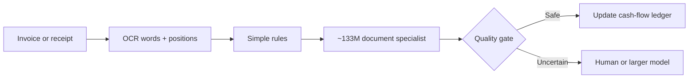

# InvoiceAgent

**A small-first cash-flow assistant for small businesses.**

InvoiceAgent reads an invoice, reads the receipt or payment record that follows it, and answers the question a business owner actually cares about:

> What do I owe, what am I waiting to collect, and what has already been paid?

## The idea in plain English

An **invoice** is a request for money. A **receipt** is evidence that money moved.

| Bookkeeping side | ELI5 meaning | Example |
|---|---|---|
| Accounts payable (AP) | Money the business must pay out | A bakery receives a flour supplier's invoice, then stores the payment receipt |
| Accounts receivable (AR) | Money customers must pay the business | The bakery invoices a catering customer, then stores proof when the customer pays |

InvoiceAgent extracts the identifying fields, matches payments to invoices, and marks each bill as unpaid, partially paid, paid, overdue, or needing review.

## Why a small model?

Most documents should not need an expensive frontier model. The routine path stays local and inexpensive; uncertain cases are escalated instead of guessed.



Ryan's current [LayoutLMv3 LoRA adapter](https://huggingface.co/ryanznie/layoutlmv3-lora-invoice-number) specializes in **invoice-number extraction**. It does not yet extract every field and it does not perform OCR. InvoiceAgent therefore keeps extraction sources visible and fails closed when the evidence is incomplete.

## Run the hackathon demo

```bash
python3.12 -m venv .venv
source .venv/bin/activate
pip install -r requirements.txt
streamlit run app.py
```

To enable the **Live local model** tab as well:

```bash
pip install -e ".[demo,test,model]"
streamlit run app.py
```

The live model tab accepts an invoice image plus an OCR JSON sidecar containing
`words`, normalized `boxes`, and an OCR `quality` score. Model weights download
on the first run. The UI shows entity-token confidence, evidence boxes, latency,
and the gate decision; it never presents background-token confidence as proof.

Run one real checkpoint smoke test against Ryan's held-out dataset:

```bash
python scripts/evaluate_layoutlm.py --sample X51005200931
```

Or run a small transparent slice, with every missing answer kept in the denominator:

```bash
python scripts/evaluate_layoutlm.py --limit 12
```

Run the tests:

```bash
pytest
```

The built-in examples are labeled **fixture replays**. They let the team demonstrate reconciliation and routing without pretending that OCR or model inference ran live. Connecting live OCR and Ryan's adapter are separately tracked acceptance criteria in the [product requirements](docs/PRD.md).

## Demo story

1. An easy supplier invoice is accepted locally.
2. A less familiar invoice is handled by the small document specialist.
3. An ambiguous document is rejected by the quality gate and sent to review.
4. A payment receipt is matched to its invoice.
5. The dashboard immediately updates money due, money collected, and overdue bills.

## Safety rule

InvoiceAgent may recommend a match, but it does **not** send money, change accounting records, or silently accept an uncertain identifier. A wrong invoice number can apply a payment to the wrong bill, so ambiguous cases fail closed.

## Team

- **Sasa:** product/demo integration and repository coordination
- **Ryan:** LayoutLMv3 specialist, extraction evaluation, and model serving
- **David:** OCR/document ingestion and fixture preparation
- **Wilson:** confidence gate, reconciliation, metrics, and presentation narrative

The detailed owner-by-owner checklist is in [docs/PRD.md](docs/PRD.md).

## Licensing

Repository code is MIT licensed. Model weights and datasets retain their own terms. In particular, the Microsoft LayoutLMv3 base model is published under CC BY-NC-SA 4.0, so this repository's MIT license does not relicense derived model weights.
