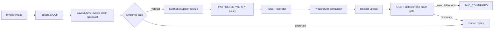

# ProcureAgent

**A small-model Accounts Payable copilot for a cash-constrained restaurant.**

ProcureAgent answers a practical question: when a restaurant has **$5,000** in cash and **$6,200** of supplier bills, which invoices should it pay now, defer, or verify so the kitchen keeps running?

It is a controlled hackathon demo. It does not connect to a bank, authorize money, or claim that one model does everything.

## The story in 30 seconds

1. Upload a supplier invoice.
2. Tesseract performs real local OCR.
3. Ryan's local LayoutLMv3 specialist highlights the token it believes is the invoice number.
4. Exact evidence checks fail closed when identity is uncertain.
5. A visibly synthetic lookup adds the amount, due date, inventory, and supplier context.
6. A deterministic policy proposes **PAY**, **DEFER**, or **VERIFY**; a verifier and a person govern the simulated action.
7. ProcureGym shows the restaurant consequence and compares the proposal with Earliest Due First. The operator can approve all seven simulated days, one decision at a time, and can MODIFY or REJECT any of them.
8. Upload a full-payment receipt. OCR plus deterministic rules—not Ryan's model—must match supplier, invoice, full amount, and currency before the demo ledger says `PAID_CONFIRMED`.

An invoice from a supplier is **Accounts Payable**: money the restaurant owes. The matching receipt is proof for this simulated payment lifecycle. Accounts Receivable and partial payments are outside the MVP.




## What is AI here—and what is not

| Step | Implementation | Honest boundary |
|---|---|---|
| Invoice OCR | Tesseract 5 | OCR is separate from the model |
| Invoice number | [`ryanznie/layoutlmv3-lora-invoice-number`](https://huggingface.co/ryanznie/layoutlmv3-lora-invoice-number) | Supervised token classifier; it does not extract amount or choose payments |
| Business fields | Immutable synthetic lookup | Looked up, never attributed to the model |
| Recommendation | Criticality-Aware Greedy v1 | Deterministic P0 policy, not a trained RL policy |
| Safety | Batch verifier + explicit operator decision | No unapproved state mutation |
| Consequence | Seeded ProcureGym | Simulation only |
| Receipt proof | Tesseract + anchored deterministic rules | No receipt-model claim; exact full match only |
| Router Lab | Constrained contextual-bandit experiment | P1 lab; no improvement claim without held-out evidence |

### Captured real-model proof

On the committed synthetic Fresh Farms invoice, an actual local run selected one OCR token, `FF-10482`, and matched the expected value exactly. The recorded inference took **197.6 ms on Apple MPS**. Its entity score was below the frozen 0.80 auto-confirm threshold, so the document gate correctly requested operator review even though the rule and model agreed. This is a one-document smoke test, not an aggregate accuracy claim; see [`model_smoke_v1.json`](data/procureagent/eval/model_smoke_v1.json).

The reproducible adapter revision is `7dc28f5a3b14aa100ba432ee1b0a6cac6c7b2c5c`; the base-model revision is `cfbbbff0762e6aab37086fdd4739ad14fe7d5db4`.

### Router Lab checkpoint

C6 fits a small tabular contextual bandit for invoice-identity routing only. On seven synthetic development rows it produced **4 correct automatic identities / 0 wrong automatic accepts / 3 reviews**, average reward `4.6621`; the fixed gate produced **3 / 0 / 4**, average `2.9029`; always-review produced **0 / 0 / 7**, average `-2.3179`. All seven development context bins also appear in training, and no frozen test was evaluated. This is a within-bin development result—not evidence of generalization, live-upload accuracy, supplier-ranking quality, or payment-action quality.

## Run the recording demo

Requirements: Python 3.12 and Tesseract 5.

```bash
python3.12 -m venv .venv-model
.venv-model/bin/pip install -e ".[demo,test,model]"
./scripts/run_demo.sh
```

Open <http://127.0.0.1:8501> and use the **/eval lab**. The first model load downloads the base model and adapter, so warm it once before presenting.

To expose the running Mac through an ephemeral Cloudflare URL:

```bash
./scripts/run_demo.sh --public
```

Keep that terminal open. The printed `trycloudflare.com` URL is a temporary, public, unauthenticated presentation endpoint with no uptime guarantee. Use synthetic fixtures only; do not upload confidential invoices.

### The seven-day governed episode

The `/eval` lane runs the whole horizon, not just day 0. Proposing a day is pure
and mutates nothing; only APPROVE calls `ProcureGym.step`. MODIFY mints a new
batch ID and must clear the verifier again, and REJECT records a decision that
provably changes no state and does not advance the day.

Two scenarios are selectable:

| Scenario | Revenue | What the timing decision looks like |
|---|---|---|
| `restaurant_demo_v1` (frozen, hash-pinned) | none | Solved on day 0. Days 1–6 are six identical no-op batches; the oracle says PackRight should be paid `never` and regret is `0.000`. |
| `restaurant_cashflow_v1` | $250/day | PackRight is deferred while unaffordable and paid on **day 2**, the day it fits. The bounded oracle independently agrees. |

The second scenario exists because the first has no interesting answer to *when*.
It is identical to the frozen fixture apart from the revenue, and it is loaded
through `load_scenario` rather than `load_locked_scenario`, so the pinned fixture
is untouched.

Useful recording fixtures:

- [`fresh_farms_invoice.png`](data/procureagent/assets/fresh_farms_invoice.png)
- [`prime_foods_invoice.png`](data/procureagent/assets/prime_foods_invoice.png)
- [`packright_invoice.png`](data/procureagent/assets/packright_invoice.png)
- [`cleanpro_invoice.png`](data/procureagent/assets/cleanpro_invoice.png)
- [`fresh_farms_payment_receipt.png`](data/procureagent/assets/fresh_farms_payment_receipt.png)
- [`receipt_provenance.json`](data/procureagent/assets/receipt_provenance.json)
- [`procureagent-dashboard.png`](docs/assets/procureagent-dashboard.png)
- [`sundai-thumbnail.png`](docs/assets/sundai-thumbnail.png) — 1200×630 card image

## Verify it

Fast suite:

```bash
.venv-model/bin/pytest
```

Acceptance artifacts:

```bash
.venv-model/bin/python scripts/eval_procureagent.py \
  --output data/procureagent/eval/acceptance_v1.json
HF_HUB_DISABLE_PROGRESS_BARS=1 \
  .venv-model/bin/python scripts/eval_procureagent.py --with-model \
  --output data/procureagent/eval/acceptance_live_v1.json
```

All four supplier invoices are bundled and every one is verified against real
Tesseract 5.5.3 to return exactly one correct anchored candidate — see
[`invoice_assets_ocr_v1.json`](data/procureagent/eval/invoice_assets_ocr_v1.json),
which claims OCR plus the deterministic rule only and does not claim a gate or
model result. Each still requires its own human CONFIRM, because the frozen 0.80
confidence threshold routes them to review.

Freeze evidence: **192 passed, 1 intentionally opt-in skip**; offline acceptance **9/9**; real-model acceptance **10/10**. The safety harness blocks **6/6** action/governance attacks and **8/8** receipt ambiguity, mismatch, duplicate, and forgery attacks.

One real checkpoint smoke:

```bash
HF_HUB_DISABLE_PROGRESS_BARS=1 \
  .venv-model/bin/python scripts/evaluate_layoutlm.py --sample X51005200931
```

The project keeps missing predictions in the denominator, separates fixture replay from live execution, and does not turn model confidence into a claimed probability of correctness.

## Deployment from Sasa's GitHub repo

The repository is prepared for Streamlit Community Cloud:

- Repository: `sasap91/invoiceagent`
- Branch: `main`
- Entrypoint: `procure_app.py`
- Python: `3.12`
- `packages.txt` installs Tesseract
- `requirements.txt` installs the app and model runtime

Streamlit requires a repository administrator to create the app. Sasa must perform the initial **Create app** click; subsequent pushes redeploy automatically. The included `Dockerfile` is the portable fallback for any container host.

## Optional Fal receipt generation

The current receipt is deterministic so its text is reliably OCR-readable. A Fal generation was attempted, but the configured Fal account reported an exhausted balance. After replenishing it:

```bash
.venv-model/bin/pip install -e ".[assets]"
.venv-model/bin/python scripts/generate_fal_receipt.py
```

The script keeps `FAL_KEY` server-side and refuses to mark the generated image demo-ready unless Tesseract recovers every required proof field.

## Team and build ownership

### Team

| Member | Background and ProcureAgent contribution |
|---|---|
| [Sasa Phanitsombat](https://www.linkedin.com/in/sasakorn-p/) | AI product and evaluation leader with 10+ years across business and technology and an MIT Sloan background. Shaped the restaurant procurement use case and co-owns ProcureGym, the demo, and evaluation proof. |
| [Ryan Nie](https://www.linkedin.com/in/ryanznie/) | Machine-learning practitioner and researcher with work spanning automated data quality and medical imaging. Created the LayoutLMv3 invoice-number asset and co-owns specialist extraction, routing, governance, and demo integration. |
| [David Lee](https://www.linkedin.com/in/authordavidlee/) / `@cheezburgerz` | AI builder and author with Boston University study across computer science and neuroscience. Co-owns OCR/document ingestion, the Router Lab, and demo integration. |
| [Dillon Johnson](https://www.linkedin.com/in/dillonqjohnson/) | Builder at the intersection of art and technology with MIT Sloan and Carnegie Mellon experience. Co-owns the document gate, recommendation governance, Router Lab, and demo integration. |
| [Wilson Wu](https://www.linkedin.com/in/wilson1wu/) / `@skylarwooster` | AI engineering and finance/product builder with Georgia Tech computer-science and AWS experience. Owns the frozen contracts, supplier/restaurant state, integrated reference path, and deployment work. |

### Build ownership

| Category | Named owners |
|---|---|
| C0 — Contracts and fixtures | Wilson / `@skylarwooster` |
| C1 — OCR and ingestion | David / `@cheezburgerz`, Ryan Nie, Dillon |
| C2 — Specialist and document gate | Ryan Nie, Dillon |
| C3 — Lookup and restaurant state | Wilson / `@skylarwooster` |
| C4 — Recommendation and governance | Ryan Nie, Dillon |
| C5 — ProcureGym and baselines | Sasa P, Wilson / `@skylarwooster` |
| C6 — Contextual-bandit Router Lab | David / `@cheezburgerz`, Ryan Nie, Dillon |
| C7 — UI and deployment | Wilson / `@skylarwooster`, Sasa P, Ryan Nie, Dillon, David / `@cheezburgerz` |
| C8 — Evaluation and presentation proof | Sasa P |

Wilson is building the integrated reference path across categories for the deadline; named owners retain review and sign-off, and compatible teammate work can merge against the frozen contracts.

See the complete [PRD](docs/PRD.md) for contracts, reward design, safety gates, acceptance criteria, and task claims.

## License and model notice

Repository code is MIT licensed. Datasets, base-model weights, and adapter weights retain their own terms; this repository's MIT license does not relicense them. The adapter card declares MIT “inherited from base,” while the Microsoft LayoutLMv3 base model declares CC BY-NC-SA 4.0 and Ryan's dataset card lists its license as unknown. Ryan must clarify weight and dataset usage before any broader licensing or deployment claim.
