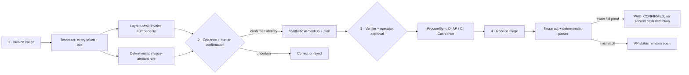
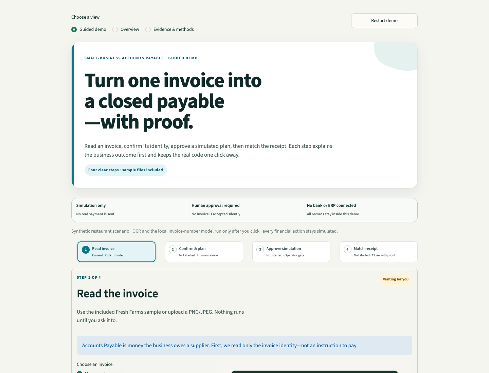

# ProcureAgent

**A small-model Accounts Payable copilot for a cash-constrained restaurant.**

ProcureAgent answers a practical question: when a restaurant has **$5,000** in cash and **$6,200** of supplier bills, which invoices should it pay now, defer, or verify so the kitchen keeps running?

It is a controlled hackathon demo. It does not connect to a bank, authorize money, or claim that one model does everything.

## The story in 30 seconds

The primary demo is one guided four-step path:

1. **Read invoice.** Choose the bundled Fresh Farms PNG or upload PNG/JPEG. Tesseract produces every OCR token, confidence, and box. Ryan's local LayoutLMv3 specialist labels the invoice-number token only; the displayed invoice amount comes from OCR plus a separate deterministic total-anchor rule.
2. **Confirm and plan.** The document gate fails closed when identity is uncertain, so the operator must **CONFIRM**, **CORRECT**, or **REJECT**. Only a confirmed composite identity unlocks the synthetic AP lookup and the explained **PAY / DEFER / VERIFY** plan.
3. **Approve simulated payment.** The verifier checks the full daily batch and an explicit operator click advances ProcureGym. In accounting terms the simulation records **Dr Accounts Payable / Cr Cash** once; no bank, ERP, or accounting system is connected.
4. **Verify receipt.** Choose the bundled receipt or upload PNG/JPEG. Tesseract plus the deterministic receipt parser—not Ryan's model—extracts and grounds supplier, invoice, full amount, currency, paid date, and receipt ID. Exact proof changes the demo status to `PAID_CONFIRMED`; it does **not** deduct cash a second time.

An invoice from a supplier is **Accounts Payable**: money the restaurant owes. The matching receipt is proof for this simulated payment lifecycle. Accounts Receivable and partial payments are outside the MVP.





## What is AI here—and what is not

| Step | Implementation | Honest boundary |
|---|---|---|
| Invoice OCR | Tesseract 5 | OCR is separate from the model |
| Invoice number | [`ryanznie/layoutlmv3-lora-invoice-number`](https://huggingface.co/ryanznie/layoutlmv3-lora-invoice-number) | Supervised token classifier; it does not extract amount or choose payments |
| Invoice amount evidence | Tesseract + deterministic total-anchor rule | Displayed from grounded OCR; never attributed to LayoutLMv3 |
| AP and restaurant fields | Immutable synthetic lookup | Canonical payable amount, due date, inventory, and criticality are looked up after identity confirmation |
| Recommendation | Criticality-Aware Greedy v1 | Deterministic P0 policy, not a trained RL policy |
| Safety | Batch verifier + explicit operator decision | No unapproved state mutation |
| Consequence | Seeded ProcureGym | Simulation records Dr AP / Cr Cash once; no real ledger or money movement |
| Receipt proof | Tesseract + deterministic receipt parser and proof gate | Changes AP lifecycle status only; no receipt-model claim and no second cash deduction |
| Router Lab | Constrained contextual-bandit experiment | P1 lab; no improvement claim without held-out evidence |

Every OCR word remains available in the guided screen with its confidence, normalized box, business label, and source. The compact story is the default; expand **Technical evidence** to inspect raw OCR, token provenance, model version/latency/scores, deterministic-rule evidence, hashes, verifier checks, and deployment provenance.

### Captured real-model proof

On the committed synthetic Fresh Farms invoice, an actual local run selected one OCR token, `FF-10482`, and matched the expected value exactly. The recorded inference took **197.6 ms on Apple MPS**. Its entity score was below the frozen 0.80 auto-confirm threshold, so the document gate correctly requested operator review even though the rule and model agreed. This is a one-document smoke test, not an aggregate accuracy claim; see [`model_smoke_v1.json`](data/procureagent/eval/model_smoke_v1.json).

The reproducible adapter revision is `7dc28f5a3b14aa100ba432ee1b0a6cac6c7b2c5c`; the base-model revision is `cfbbbff0762e6aab37086fdd4739ad14fe7d5db4`.

### Router Lab checkpoint

C6 fits a small tabular contextual bandit for invoice-identity routing only. On seven synthetic development rows it produced **4 correct automatic identities / 0 wrong automatic accepts / 3 reviews**, average reward `4.6621`; the fixed gate produced **3 / 0 / 4**, average `2.9029`; always-review produced **0 / 0 / 7**, average `-2.3179`. All seven development context bins also appear in training, and no frozen test was evaluated. This is a within-bin development result—not evidence of generalization, live-upload accuracy, supplier-ranking quality, or payment-action quality.

## Run the recording demo

Requirements: Python 3.12 and Tesseract 5.

```bash
python3.12 -m venv .venv-model
.venv-model/bin/pip install -e ".[demo,test,model]"
./scripts/run_demo.sh
```

Open <http://127.0.0.1:8501> and follow the four-step guided demo: **Read invoice → Confirm & plan → Approve simulation → Verify receipt**. The first model load downloads the base model and adapter (`ryanznie/layoutlmv3-lora-invoice-number`) from Hugging Face, so warm it once before presenting. Technical evidence is available in the expandable evidence panels without interrupting the main story.

If you have a local checkout of the adapter (e.g. from the `invoice-ner` training repo) and want to run against it instead of downloading from the Hub, point these env vars at it before launching Streamlit:

```bash
export INVOICEAGENT_ADAPTER_MODEL=/path/to/invoice-ner/models/layoutlmv3-lora-invoice-number
export INVOICEAGENT_ADAPTER_REVISION=
./scripts/run_demo.sh
```

To expose the running Mac through an ephemeral Cloudflare URL:

```bash
./scripts/run_demo.sh --public
```

Keep that terminal open. The printed `trycloudflare.com` URL is a temporary, public, unauthenticated presentation endpoint with no uptime guarantee. Use synthetic fixtures only; do not upload confidential invoices.

Useful recording fixtures:

- [`fresh_farms_invoice.png`](data/procureagent/assets/fresh_farms_invoice.png)
- [`fresh_farms_payment_receipt.png`](data/procureagent/assets/fresh_farms_payment_receipt.png)
- [`receipt_provenance.json`](data/procureagent/assets/receipt_provenance.json)
- [`model_smoke_v1.json`](data/procureagent/eval/model_smoke_v1.json)
- [`procureagent-dashboard.png`](docs/assets/procureagent-dashboard.png)
- [`sundai-thumbnail.png`](docs/assets/sundai-thumbnail.png) — 1200×630 card image

## Verify it

Fast suite:

```bash
.venv-model/bin/pytest
```

Acceptance artifacts:

```bash
.venv-model/bin/python scripts/eval_procureagent.py \
  --output data/procureagent/eval/acceptance_v1.json
HF_HUB_DISABLE_PROGRESS_BARS=1 \
  .venv-model/bin/python scripts/eval_procureagent.py --with-model \
  --output data/procureagent/eval/acceptance_live_v1.json
```

Current evidence: **208 passed, 2 intentionally opt-in real-Tesseract smokes skipped** in the default run; the focused smoke run passes **32/32** with both enabled. Offline acceptance is **9/9** and real-model acceptance is **10/10**. The safety harness blocks **6/6** action/governance attacks and **8/8** receipt ambiguity, mismatch, duplicate, and forgery attacks.

One real checkpoint smoke:

```bash
HF_HUB_DISABLE_PROGRESS_BARS=1 \
  .venv-model/bin/python scripts/evaluate_layoutlm.py --sample X51005200931
```

The project keeps missing predictions in the denominator, separates fixture replay from live execution, and does not turn model confidence into a claimed probability of correctness.

## Permanent deployment

The preferred non-Streamlit-hosting path is the included Docker container on **Google Cloud Run**. A Firebase project is also a Google Cloud project, but Firebase Hosting by itself is static and cannot execute this Python/Tesseract/PyTorch runtime. Follow the [Cloud Run deployment guide](docs/CLOUD_RUN_DEPLOY.md) after the owner approves a dedicated project and billing account.

Streamlit Community Cloud remains an optional fastest path for a repository administrator; [Sasa's one-time handoff](docs/SASA_STREAMLIT_DEPLOY.md) is retained in case the team chooses it. Until either permanent URL is created and verified, a `trycloudflare.com` Quick Tunnel is only a temporary, public, unauthenticated fallback: its URL changes on restart, it has no uptime guarantee, the host Mac must stay awake, and it must carry synthetic fixtures only.

## Optional Fal receipt generation

The current receipt is deterministic so its text is reliably OCR-readable. A Fal generation was attempted, but the configured Fal account reported an exhausted balance. After replenishing it:

```bash
.venv-model/bin/pip install -e ".[assets]"
.venv-model/bin/python scripts/generate_fal_receipt.py
```

The script keeps `FAL_KEY` server-side and refuses to mark the generated image demo-ready unless Tesseract recovers every required proof field.

## Team and build ownership

### Team

| Member | Background and ProcureAgent contribution |
|---|---|
| [Sasa Phanitsombat](https://www.linkedin.com/in/sasakorn-p/) | AI product and evaluation leader with 10+ years across business and technology and an MIT Sloan background. Shaped the restaurant procurement use case and co-owns ProcureGym, the demo, and evaluation proof. |
| [Ryan Nie](https://www.linkedin.com/in/ryanznie/) | Machine-learning practitioner and researcher with work spanning automated data quality and medical imaging. Created the LayoutLMv3 invoice-number asset and co-owns specialist extraction, routing, governance, and demo integration. |
| [David Lee](https://www.linkedin.com/in/authordavidlee/) / `@cheezburgerz` | AI builder and author with Boston University study across computer science and neuroscience. Co-owns OCR/document ingestion, the Router Lab, and demo integration. |
| [Dillon Johnson](https://www.linkedin.com/in/dillonqjohnson/) | Builder at the intersection of art and technology with MIT Sloan and Carnegie Mellon experience. Co-owns the document gate, recommendation governance, Router Lab, and demo integration. |
| [Wilson Wu](https://www.linkedin.com/in/wilson1wu/) / `@skylarwooster` | AI engineering and finance/product builder with Georgia Tech computer-science and AWS experience. Owns the frozen contracts, supplier/restaurant state, integrated reference path, and deployment work. |

### Build ownership

| Category | Named owners |
|---|---|
| C0 — Contracts and fixtures | Wilson / `@skylarwooster` |
| C1 — OCR and ingestion | David / `@cheezburgerz`, Ryan Nie, Dillon |
| C2 — Specialist and document gate | Ryan Nie, Dillon |
| C3 — Lookup and restaurant state | Wilson / `@skylarwooster` |
| C4 — Recommendation and governance | Ryan Nie, Dillon |
| C5 — ProcureGym and baselines | Sasa P, Wilson / `@skylarwooster` |
| C6 — Contextual-bandit Router Lab | David / `@cheezburgerz`, Ryan Nie, Dillon |
| C7 — UI and deployment | Wilson / `@skylarwooster`, Sasa P, Ryan Nie, Dillon, David / `@cheezburgerz` |
| C8 — Evaluation and presentation proof | Sasa P |

Wilson is building the integrated reference path across categories for the deadline; named owners retain review and sign-off, and compatible teammate work can merge against the frozen contracts.

See the complete [PRD](docs/PRD.md) for contracts, reward design, safety gates, acceptance criteria, and task claims.

## License and model notice

Repository code is MIT licensed. Datasets, base-model weights, and adapter weights retain their own terms; this repository's MIT license does not relicense them. The adapter card declares MIT “inherited from base,” while the Microsoft LayoutLMv3 base model declares CC BY-NC-SA 4.0 and Ryan's dataset card lists its license as unknown. Ryan must clarify weight and dataset usage before any broader licensing or deployment claim.
