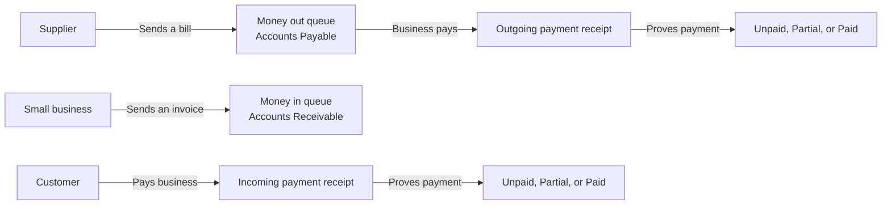
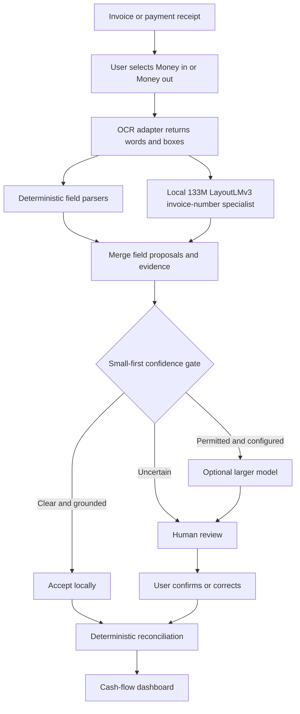
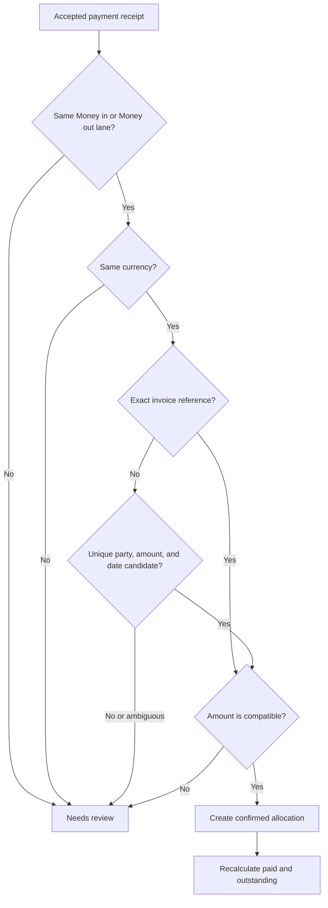
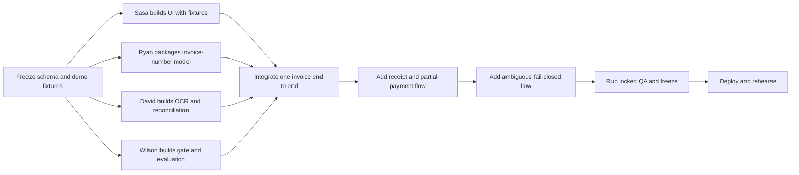

# InvoiceAgent — Hackathon MVP Product Requirements Document

**Working title:** InvoiceAgent  
**One-line promise:** Turn invoices and payment receipts into a simple, trustworthy view of what a small business owes, what customers owe it, and what has already been paid.  
**Owners:** Sasa, Ryan, David, and Wilson  
**Status:** Approved direction; implementation-ready  
**Audience:** The four builders, hackathon judges, and anyone testing the demo

---

## 1. The idea in one minute

A small business receives many documents. Some ask the business to pay a supplier. Others ask a customer to pay the business. Later, receipts or payment confirmations prove that money moved. Today, an owner often has to read every document, copy several numbers into a spreadsheet, and remember which payment belongs to which invoice.

InvoiceAgent does the repetitive first pass:

1. The owner uploads an invoice or a payment receipt.
2. The system reads the document and shows the exact words it used as evidence.
3. A small, local model helps find the invoice number.
4. Simple extractors find the amount, dates, party, and payment reference.
5. A confidence gate accepts clear results and refuses uncertain ones.
6. Accepted receipts are matched to invoices.
7. The dashboard shows **Unpaid**, **Partial**, **Paid**, and **Overdue** items.

The important product claim is not “AI reads every document perfectly.” It is:

> **A small specialist handles routine documents locally, while uncertain documents are visibly escalated instead of silently entering the books.**

### ELI5 example

Maya owns a small print shop.

- A paper supplier sends Maya invoice `PAPER-204` for `$500`. This is **Accounts Payable**: Maya expects `$500` to go **out**.
- Maya pays `$300` and receives receipt `PAY-781`. InvoiceAgent links the receipt to the invoice. The invoice becomes **Partial**, with `$200` left.
- Maya later pays the remaining `$200`. The invoice becomes **Paid**.
- Maya sends customer Lee invoice `PRINT-902` for `$800`. This is **Accounts Receivable**: Maya expects `$800` to come **in**.
- When Lee's `$800` payment receipt arrives, InvoiceAgent links it and marks that invoice **Paid**.

An invoice asks for money. A receipt proves that money moved. They are related, but they are not the same document.

---

## 2. The cash-flow picture

The UI should use plain labels first and accounting terms second.

| Plain-language lane | Accounting term | What it means | Example |
|---|---|---|---|
| **Money out** | Accounts Payable, or AP | Bills the business owes suppliers | Paper supplier invoices the shop |
| **Money in** | Accounts Receivable, or AR | Money customers owe the business | Shop invoices a customer |



One business's receivable can be another business's payable. InvoiceAgent always displays the document from the logged-in business's point of view.

---

## 3. Why this fits the small-model theme

InvoiceAgent is not another chat window. It embeds a small model inside a real workflow that repeats every time a financial document arrives.

### What exists today

Ryan has already fine-tuned a LayoutLMv3 document model with a LoRA adapter for **invoice-number token classification**:

- The base model is roughly 0.1B parameters, approximately 133M parameters before the adapter.
- It uses an image together with OCR words and their bounding boxes.
- It specializes in proposing the **invoice number**.
- It does **not** perform OCR by itself.
- It has not yet been demonstrated to extract every amount, date, party, or receipt number.

For this MVP:

- Ryan's model proposes invoice numbers.
- OCR plus deterministic parsers propose amounts, dates, parties, and receipt or payment references.
- Every proposed field carries evidence and confidence.
- A small-first gate accepts, escalates, or asks for review.

This is intentionally honest. We will not claim that one model performs tasks it has not been trained and evaluated to perform.

### Current evidence is preliminary

Ryan's existing notebooks report promising preliminary results, including approximately 81.42% exact match for the model-only invoice-number path and 294 correct results out of 323 documents, or 91.02%, for a hybrid path. A preliminary acceptance rule reports 289 correct among 296 accepted documents, or 97.64% selective accuracy.

These results are useful starting points, not production claims. Before using them in the presentation, the team must reproduce them from a documented command on a locked test set and must keep missing predictions in the denominator.

---

## 4. Product goals

### Must achieve in the hackathon MVP

1. Make money-in and money-out documents understandable to a small-business owner.
2. Extract the minimum fields needed to track an invoice and its payments.
3. Show where each extracted value came from on the source document.
4. Use Ryan's small local model for the task it currently supports: invoice-number extraction.
5. Match full and partial payment receipts to invoices.
6. Show unpaid, partial, paid, and overdue states without doing arithmetic incorrectly.
7. Fail closed: uncertain data must go to review and must not silently change a payment state.
8. Demonstrate the cost and privacy benefit of resolving routine documents locally.
9. Provide a public, reliable demo URL and a repeatable local demo.

### Success statement

At the end of the demo, a judge should be able to say:

> “I saw a small model read an invoice number, I saw the evidence, I watched two receipts reduce the balance, and I saw the system refuse an ambiguous document instead of guessing.”

---

## 5. What is in and out of scope

### In scope for the MVP

- Printed English-language invoice and receipt images, preferably PNG or JPEG
- One small business profile
- Two upload lanes: **Money out / AP** and **Money in / AR**
- Document types: invoice and payment receipt or confirmation
- Invoice fields:
  - invoice number
  - total amount
  - currency
  - issue date
  - due date when present
  - supplier or customer name
- Receipt fields:
  - receipt number or payment reference
  - amount paid
  - currency
  - payment date
  - payer or payee name
  - referenced invoice number when present
- Evidence highlighting and per-field confidence
- Local extraction, confidence gating, human review, and optional remote escalation
- One receipt applied to one invoice
- Multiple receipts applied to one invoice, enabling partial payments
- Duplicate detection by document hash
- A dashboard and a small locked evaluation set

### Explicitly out of scope for the MVP

- Sending payments, initiating bank transfers, or collecting money
- Replacing an accountant or producing certified books
- Tax, legal, fraud, or regulatory advice
- General ledger, inventory, payroll, or full accounting software
- Automatic currency conversion
- One payment split across multiple invoices
- Credits, refunds, chargebacks, overpayments, or negative invoices
- Full line-item extraction
- Guaranteed handwriting support
- Training a new universal document model during the hack
- Fully autonomous operation without review
- Production authentication, multitenancy, disaster recovery, or enterprise compliance

When an out-of-scope case appears, the system should label it **Needs review** rather than inventing an answer.

---

## 6. Primary users and jobs

### Primary user

A small-business owner or office manager who receives invoices and payment confirmations but does not want to maintain a complex accounting system.

### Jobs to be done

- “Tell me what I still need to pay.”
- “Tell me which customers still owe me money.”
- “Show me what has already been paid and the receipt that proves it.”
- “Warn me before an unpaid invoice becomes late.”
- “Do not quietly enter the wrong invoice number or amount.”

### Secondary user

A bookkeeper who wants a review queue with the original image, extracted evidence, and a clear reason for uncertainty.

---

## 7. User journey

### First-time setup

1. User enters the business name and optional aliases.
2. User chooses the display currency for the dashboard. The original document currency is always preserved.
3. The app opens to two large choices:
   - **A supplier wants me to pay — Money out / AP**
   - **A customer owes me money — Money in / AR**

The user chooses the lane. The model may suggest a lane later, but the MVP must not silently decide the financial direction.

### Invoice journey

1. User chooses Money out or Money in.
2. User uploads an invoice.
3. The app runs OCR.
4. Rules and the local invoice-number specialist propose fields.
5. The app shows highlighted source evidence next to every important field.
6. The confidence gate chooses:
   - **Accepted locally**
   - **Needs review**
   - **Escalate**, only if remote escalation is configured and the user permits it
7. User confirms or corrects review fields.
8. The invoice enters the ledger as Unpaid, with an Overdue badge when appropriate.

### Receipt journey

1. User chooses Money out or Money in.
2. User uploads a payment receipt or confirmation.
3. The app extracts the receipt or payment reference, amount, date, party, and any invoice reference.
4. The matching engine proposes an invoice and explains why.
5. A unique, safe match can be accepted; ambiguous matches go to review.
6. The paid and outstanding amounts are recalculated.
7. The user can open the invoice and see every linked receipt.

---

## 8. End-to-end architecture



### Small-first routing rule

Use the least expensive trustworthy lane:

1. **OCR and rules:** Good at recognizable labels, dates, and amounts.
2. **Local specialist:** Good at its narrow learned task, invoice-number extraction.
3. **Quality gate:** Checks that the result is grounded and internally consistent.
4. **Human or larger model:** Handles exceptions. A human-review path is always available; remote AI is optional.

If remote escalation is enabled, the UI must say that the document may leave the device. We may say the **routine path is local**. We must not claim the entire system is private when a remote service receives the document.

---

## 9. Functional requirements

Priority meanings:

- **P0:** Required for the live demonstration
- **P1:** Required for a credible hackathon submission
- **P2:** Valuable only after the complete vertical slice works

| ID | Priority | Requirement |
|---|---:|---|
| FR-01 | P0 | The user can explicitly upload to a Money out / AP lane or a Money in / AR lane. |
| FR-02 | P0 | The app accepts a PNG or JPEG invoice or payment receipt and produces an immutable document ID plus SHA-256 duplicate key. |
| FR-03 | P0 | An OCR adapter returns ordered words, normalized bounding boxes, and raw text. Precomputed OCR fixtures may be used as a clearly labeled demo fallback. |
| FR-04 | P0 | Ryan's local LayoutLMv3 adapter proposes an invoice number from the image plus OCR words and boxes. |
| FR-05 | P0 | The model wrapper returns the proposed invoice number, selected token probabilities, selected token boxes, latency, and model version. It must not average confidence across unrelated `O` tokens. |
| FR-06 | P0 | Deterministic extractors propose total or paid amount, currency, dates, party, and receipt or payment reference from OCR. |
| FR-07 | P0 | Every accepted core field includes visible source evidence, extraction method, and confidence. |
| FR-08 | P0 | The quality gate returns exactly one routing decision: `accept`, `review`, or `escalate`, plus machine-readable reasons. |
| FR-09 | P0 | A review screen shows the source image beside proposed fields and allows the user to correct them. |
| FR-10 | P0 | Only accepted or user-confirmed fields may create or update an active ledger record. |
| FR-11 | P0 | The app links a payment receipt to a compatible invoice and records the amount allocated. |
| FR-12 | P0 | The ledger calculates paid and outstanding amounts using decimal or integer-minor-unit arithmetic, never binary floating point. |
| FR-13 | P0 | The dashboard displays Money out and Money in separately, with Unpaid, Partial, Paid, and Overdue labels. |
| FR-14 | P0 | An invoice detail view lists every linked receipt and its evidence. |
| FR-15 | P0 | Re-uploading the same document must not create a duplicate invoice, receipt, or payment allocation. |
| FR-16 | P1 | When more than one invoice is a plausible match, the receipt goes to review and no balance changes. |
| FR-17 | P1 | The app can continue to human review if OCR, the local model, or an optional remote model is unavailable. |
| FR-18 | P1 | An evaluation command reports exact match, accepted coverage, selective accuracy, wrong-auto-accept rate, review rate, and latency. |
| FR-19 | P1 | The UI identifies which lane handled each field: rule, local specialist, remote escalation, or human. |
| FR-20 | P1 | A deployed health endpoint distinguishes web, OCR, and model readiness without exposing secrets. |
| FR-21 | P2 | A local export produces CSV or JSON for confirmed invoices, receipts, and matches. |
| FR-22 | P2 | A user can manually unlink an incorrect receipt match, with an audit event. |

---

## 10. Canonical data contract

All components must use this contract. Renaming fields in one component without updating the contract will break parallel work.

### Extracted document

```json
{
  "document_id": "doc_01",
  "document_hash": "sha256:...",
  "document_type": "invoice",
  "account_lane": "payable",
  "money_flow": "out",
  "business_id": "demo_print_shop",
  "counterparty": {
    "name": "Acme Paper Co",
    "role": "supplier"
  },
  "identifiers": {
    "invoice_number": "PAPER-204",
    "receipt_number": null,
    "payment_reference": null
  },
  "money": {
    "currency": "USD",
    "total_minor": 50000,
    "paid_minor": null
  },
  "dates": {
    "issue_date": "2026-08-01",
    "due_date": "2026-09-15",
    "payment_date": null
  },
  "fields": {
    "invoice_number": {
      "value": "PAPER-204",
      "method": "layoutlmv3_local",
      "confidence": 0.97,
      "status": "accepted",
      "evidence": [{"text": "Invoice No. PAPER-204", "box": [110, 80, 390, 120]}]
    }
  },
  "routing": {
    "decision": "accept",
    "reasons": ["entity_confident", "ocr_grounded", "format_valid"],
    "remote_used": false
  },
  "model_version": "layoutlmv3-invoice-number:<commit-or-artifact-id>",
  "created_at": "2026-08-30T18:00:00Z"
}
```

### Required enumerations

| Field | Allowed values |
|---|---|
| `document_type` | `invoice`, `payment_receipt`, `unknown` |
| `account_lane` | `payable`, `receivable` |
| `money_flow` | `out`, `in` |
| field `status` | `accepted`, `review`, `missing`, `user_confirmed` |
| routing `decision` | `accept`, `review`, `escalate` |
| extraction `method` | `rule`, `layoutlmv3_local`, `remote_model`, `user` |

### Invoice ledger record

```json
{
  "ledger_item_id": "ledger_01",
  "invoice_document_id": "doc_01",
  "account_lane": "payable",
  "currency": "USD",
  "invoice_total_minor": 50000,
  "paid_total_minor": 30000,
  "outstanding_minor": 20000,
  "payment_status": "partial",
  "timing_status": "current",
  "receipt_document_ids": ["doc_02"]
}
```

Use two status axes so the app does not lose information:

- `payment_status`: `unpaid`, `partial`, or `paid`
- `timing_status`: `current` or `overdue`

The UI can therefore show **Partial · Overdue** instead of incorrectly choosing only one label.

### Arithmetic rules

```text
paid_total_minor = sum(confirmed payment allocations)
outstanding_minor = max(invoice_total_minor - paid_total_minor, 0)
```

- `paid` when outstanding is zero and at least one confirmed allocation exists
- `partial` when paid is greater than zero and outstanding is greater than zero
- `unpaid` when paid is zero
- `overdue` when outstanding is greater than zero, a due date exists, and the due date is before today

Currency values must use integer minor units, such as cents, or exact decimal arithmetic. Never use a binary floating-point value for financial totals.

---

## 11. Extraction and confidence-gate rules

### Field ownership in the MVP

| Field | Primary extraction path | Honest limitation |
|---|---|---|
| Invoice number | Anchored rule plus Ryan's LayoutLMv3 specialist | Model requires OCR and is currently specialized for this field |
| Receipt or payment reference | OCR plus anchored rules | Goes to review if no clear label or format exists |
| Total invoice amount | OCR plus labels such as `Total`, excluding subtotal and tax | Multiple competing totals require review |
| Amount paid | OCR plus receipt-specific labels | Must not be assumed from an unrelated amount |
| Currency | Currency symbol and ISO-code rules | Ambiguous symbols require business default plus user confirmation |
| Dates | OCR plus date parser and nearby labels | Issue, due, and payment dates must not be silently swapped |
| Counterparty | OCR header and known-business-name exclusion | Low-confidence party names require review |
| Document type | Rules with user confirmation | The chosen upload flow remains authoritative |

### A field may be accepted only when

- Its evidence appears in the OCR or is user-entered.
- Its normalized value is syntactically valid.
- Its value is not contradicted by a stronger field candidate.
- Confidence is calculated from the selected entity tokens or extraction evidence, not from easy background tokens.
- Required cross-checks pass, such as a nonnegative amount and valid date.

### Useful gate signals

- Minimum and mean probability across selected invoice-number tokens
- Margin between the winning candidate and runner-up
- Valid, contiguous BIO span
- Agreement between rule and model
- Exact grounding in OCR text
- Proximity to labels such as `Invoice No`, `Invoice #`, or `Reference`
- OCR quality near the selected box
- Identifier format and length
- Rejection of candidates that look like dates, telephone numbers, totals, or tax IDs
- Stability across a second crop or OCR pass, if available

### Gate outputs

| Decision | Meaning | Ledger effect |
|---|---|---|
| `accept` | Evidence is clear and checks agree | May create or update a draft ledger item |
| `review` | Missing, conflicting, or ambiguous evidence | No ledger update until user confirmation |
| `escalate` | Optional larger-model lane is allowed and configured | No ledger update until the escalated answer passes checks or is confirmed |

The gate must output reasons such as `currency_conflict`, `two_invoice_candidates`, `amount_missing`, or `low_entity_margin`. “Low confidence” alone is not enough for debugging or a useful demo.

---

## 12. Reconciliation rules

Reconciliation means deciding which receipt pays which invoice. It is deterministic after extraction; a language model does not perform the balance arithmetic.



### Hard rules

1. A Money out receipt can match only a Money out / AP invoice.
2. A Money in receipt can match only a Money in / AR invoice.
3. Currencies must match. The MVP performs no conversion.
4. A receipt can be allocated to only one invoice in the MVP.
5. A duplicate receipt cannot be allocated twice.
6. A payment greater than the outstanding balance requires review.
7. An amount-only match is never sufficient when multiple invoices share that amount.
8. An exact normalized invoice reference is the strongest match signal, but direction and currency checks still apply.
9. Without an exact reference, auto-match only when party, currency, amount, and plausible date produce one unique candidate with no close alternative.
10. Low-confidence or unconfirmed extracted fields are not eligible for automatic matching.

Every match stores its reasons, source documents, allocated amount, and creation method.

---

## 13. Safety, privacy, and fail-closed behavior

This product summarizes records; it does not move money. Nevertheless, a wrong “Paid” label can cause a real cash-flow mistake.

### Non-negotiable safeguards

- **No silent guessing:** Missing or contradictory core values go to review.
- **No payment actions:** The app cannot initiate a transfer, send an invoice, or charge a customer.
- **No low-confidence ledger mutation:** Review and escalation results do not affect balances until accepted.
- **No duplicate counting:** Hash and receipt-reference checks run before reconciliation.
- **No amount-only ambiguous match:** Multiple candidates always require review.
- **No float arithmetic:** Store money as integer minor units or exact decimals.
- **Evidence always available:** Users can see what text and region produced a value.
- **Direction is explicit:** Money in and Money out are selected by the user for the MVP.
- **Model failure is recoverable:** Timeout, missing model artifact, malformed response, or OCR failure produces review—not an empty accepted value.
- **Remote use is disclosed:** A document leaves the machine only when remote escalation is enabled and permitted.
- **Secrets stay server-side:** Keys and tokens never appear in browser bundles, logs, fixtures, or commits.
- **Demo data is non-sensitive:** Use public or synthetic documents only.

### Fail-closed examples

| Situation | Required behavior |
|---|---|
| Model returns no invoice number | Show Missing and request review |
| Model and anchored rule disagree | Show both candidates and request review |
| OCR is unavailable | Use labeled precomputed OCR only for demo fixtures, otherwise review |
| Two unpaid invoices both match a receipt | Do not allocate; show both candidates |
| Receipt currency differs from invoice | Do not allocate |
| Same receipt is uploaded twice | Return the existing record; do not add payment twice |
| Optional remote service times out | Preserve local proposals and send to human review |
| Due date is missing | Do not call the invoice overdue |

### Licensing note

Repository code and model-weight licenses are separate. The Microsoft LayoutLMv3 base model card currently lists CC BY-NC-SA 4.0, while Ryan's adapter card describes an MIT license inherited from the base. The team must verify and accurately disclose the base and derived-weight terms before making commercial-use or MIT-only claims. This does not prevent a properly attributed hackathon demonstration, but it must not be papered over.

---

## 14. Metrics and evaluation

Accuracy alone can hide the most dangerous error: confidently accepting a wrong value. Report both quality and coverage.

### Extraction metrics

- Strict exact match for invoice number, receipt number, amount, currency, date, and party
- Normalized exact match, reported separately from strict exact match
- Per-field missing rate
- End-to-end all-required-fields accuracy
- Evidence-grounding rate

### Routing metrics

- **Auto-accept coverage:** accepted documents divided by all documents
- **Selective accuracy:** correct accepted documents divided by accepted documents
- **Wrong-auto-accept rate:** wrong accepted documents divided by all documents
- Review and escalation rates
- Gate reasons by frequency

### Reconciliation metrics

- Correct automatic matches
- Wrong automatic matches
- Correct review decisions on ambiguous cases
- Duplicate-payment prevention rate
- Exact outstanding-balance accuracy

### System metrics

- p50 and p95 local latency
- Peak memory on the demonstration machine
- Local specialist invocation count
- Remote escalation count
- Estimated remote calls per 1,000 documents

### Hackathon targets, not pre-existing claims

| Metric | MVP target |
|---|---:|
| Accepted invoice-number selective accuracy on locked fixtures | at least 97% |
| Auto-accept coverage on locked fixtures | at least 80% |
| Wrong automatic receipt matches on seeded demo and ambiguity tests | 0 |
| Duplicate receipts counted twice | 0 |
| Exact balances across demo scenarios | 100% |
| Local-path p95 on the demonstration laptop | under 5 seconds with the selected OCR path |

The test set must remain untouched by training, threshold selection, prompt tuning, or manual exception rules. If the dataset is too small for a strong generalization claim, say so.

### Baselines to compare

1. OCR and rules only
2. LayoutLMv3 invoice-number model only
3. Current rule-plus-model hybrid
4. Calibrated small-first gate
5. Optional larger model, if included

“Not Found” is a failure for end-to-end extraction and remains in the denominator. A selective metric may exclude reviewed documents only when its label and coverage are shown beside it.

---

## 15. User interface requirements

### Screen 1: Dashboard

- Money in total and Money out total
- Outstanding balance by lane
- Cards or table rows with invoice number, party, total, paid, outstanding, due date, and status
- Clear **Partial · Overdue** combination when both are true
- Counts for Accepted locally, Needs review, and Escalated

### Screen 2: Upload

- Two large lane selectors in plain language
- Invoice versus payment receipt choice
- Drag-and-drop image upload
- Clear local-processing and remote-escalation disclosure
- Progress steps: OCR, local extraction, quality check, matching

### Screen 3: Evidence and review

- Source image on one side
- Extracted fields on the other
- Highlighted box when a field is selected
- Value, method, and confidence for every field
- Specific review reason
- Confirm, edit, or reject controls

### Screen 4: Invoice detail

- Original invoice
- Total, paid, and outstanding amounts
- Payment and timing statuses
- Timeline of matched receipts
- Reason each receipt matched

The UI should never display a decimal confidence value as if it were a guarantee. Prefer labels such as **Accepted locally** and **Needs review**, with technical confidence available in a details panel.

---

## 16. Live demo script

Target length: 2 to 3 minutes.

### Setup

- Public URL is open before presenting.
- Local model and OCR health indicators are green.
- Four public or synthetic documents are preloaded as a network-independent fallback.
- The same documents can also be uploaded live.

### Script

1. **Explain the two lanes — 20 seconds**  
   “Money out is what we owe suppliers. Money in is what customers owe us. An invoice asks for payment; a receipt proves it happened.”

2. **Easy supplier invoice — 35 seconds**  
   Upload `PAPER-204` for `$500`. Show the 133M local specialist highlighting the invoice number. Point to the amount, due date, and supplier evidence. The invoice appears as **Unpaid**.

3. **Partial payment — 25 seconds**  
   Upload receipt `PAY-781` for `$300`. Show why it matches. The dashboard becomes **Partial**, with `$200` outstanding.

4. **Final payment — 20 seconds**  
   Upload the `$200` receipt. The deterministic balance becomes `$0`, and the invoice becomes **Paid**.

5. **Ambiguous document — 30 seconds**  
   Upload a receipt that could match two invoices or has conflicting evidence. Show that InvoiceAgent refuses to alter either balance and opens review.

6. **Money in example — 20 seconds**  
   Show a customer invoice in AR and its incoming receipt, proving the same engine handles cash expected in.

7. **Close — 15 seconds**  
   “We do not call a frontier model on every document. A small specialist works at ingestion, the accounting math stays deterministic, and expensive intelligence or a human handles only exceptions.”

### What the audience must visibly see

- The local model lane
- Highlighted evidence
- Model or rule provenance
- Latency
- No remote call on routine examples
- A balance changing from `$500` to `$200` to `$0`
- An ambiguous example failing closed

---

## 17. Acceptance criteria

| ID | Given | When | Then |
|---|---|---|---|
| AC-01 | A valid Money out supplier invoice | It is uploaded with usable OCR | Invoice number, total, currency, party, and available dates appear with evidence; uncertain required fields go to review |
| AC-02 | A valid Money in customer invoice | It is confirmed | It appears only in the receivable lane |
| AC-03 | A `$500` invoice with no receipt | The dashboard loads | It shows `$0` paid, `$500` outstanding, and Unpaid |
| AC-04 | A confirmed `$300` compatible receipt | It is matched to the `$500` invoice | It shows `$300` paid, `$200` outstanding, and Partial |
| AC-05 | A later confirmed `$200` compatible receipt | It is matched | It shows `$500` paid, `$0` outstanding, and Paid |
| AC-06 | An unpaid or partial invoice whose due date has passed | The dashboard loads | It also shows Overdue without losing its payment status |
| AC-07 | One receipt is compatible with two invoices | Matching runs | Neither balance changes and the receipt enters review |
| AC-08 | A receipt and invoice have different currencies | Matching runs | No match is created |
| AC-09 | The same receipt is uploaded twice | The second upload completes | No duplicate payment allocation is created |
| AC-10 | Ryan's model is unavailable | A document is uploaded | The app remains usable and routes the invoice number to review |
| AC-11 | The specialist returns a confident value not present in OCR | The gate runs | The value is not auto-accepted |
| AC-12 | Remote escalation is disabled | A low-confidence document arrives | It goes to human review and no remote request occurs |
| AC-13 | A user corrects an extracted field | The correction is confirmed | Reconciliation uses the corrected value and marks its method as `user` |
| AC-14 | The locked fixture suite runs | Evaluation completes | It reports quality, coverage, false accepts, review rate, reconciliation errors, and latency |
| AC-15 | The public deployment is opened in a clean browser | The demo flow runs | No local absolute paths, private tokens, or developer-only dependencies block it |

The MVP is not “done” if the happy-path UI works but ambiguous documents can silently change balances.

---

## 18. Ownership and parallel work plan

Each person owns a module and a testable contract. Anyone can help another owner, but only the owner merges changes to that module during the final integration window.

### Sasa — Product shell, frontend, and deployment

**Owns:** web experience and the public demonstration

- [ ] Scaffold the application and agree on the folder structure before parallel work starts.
- [ ] Build the Money in and Money out dashboard.
- [ ] Build upload controls for invoice and receipt documents.
- [ ] Build the evidence-and-review screen with image bounding-box overlays.
- [ ] Build invoice detail and receipt timeline views.
- [ ] Consume the canonical JSON contract in this PRD; use fixtures until APIs are ready.
- [ ] Display route, reason, latency, and local-versus-remote status.
- [ ] Provide loading, error, empty, review, and model-unavailable states.
- [ ] Deploy the public URL and verify it from a clean browser.
- [ ] Keep a preloaded demo mode that works if live upload or local inference fails.

**Sasa is done when:** all four demo documents can be presented from fixtures, then switched to live API responses without changing UI components.

### Ryan — Local model and invoice-number extraction

**Owns:** reproducible LayoutLMv3 inference and model evidence

- [ ] Package the existing adapter behind one callable or endpoint: `extract_invoice_number(image, ocr_words, ocr_boxes)`.
- [ ] Return invoice-number value, selected tokens, selected boxes, entity-token probabilities, runtime, and model version.
- [ ] Calculate confidence from the predicted entity span, not all background words.
- [ ] Add a deterministic invoice-label candidate so rule/model agreement is available to the gate.
- [ ] Fix or bypass any training-loss handling that uses `ignore_index = -100` unsafely before retraining.
- [ ] Produce a documented, one-command evaluation on a locked split.
- [ ] Report strict exact match, missing predictions, and latency without dropping failures.
- [ ] Supply at least one confident correct fixture, one wrong fixture, and one missing-result fixture.
- [ ] Document that OCR is an input dependency.
- [ ] Document base-model and adapter license terms accurately.

**Ryan is done when:** another team member can run one command against a fixture and receive contract-valid invoice-number evidence without opening a notebook.

### David — OCR, field parsing, and reconciliation engine

**Owns:** deterministic document plumbing and accounting arithmetic

- [ ] Implement the OCR adapter interface returning words, boxes, raw text, and OCR metadata.
- [ ] Provide precomputed OCR for all locked demo and evaluation documents.
- [ ] Implement parsers for amounts, currencies, issue/due/payment dates, parties, and receipt/payment references.
- [ ] Ensure every parser returns value, confidence, evidence, method, and review reasons.
- [ ] Implement document hashing and duplicate checks.
- [ ] Implement the hard reconciliation rules in Section 12.
- [ ] Store payment allocations using integer minor units or exact decimals.
- [ ] Calculate unpaid, partial, paid, current, and overdue states.
- [ ] Add unit tests for partial payment, full payment, duplicate receipt, currency mismatch, and ambiguous matching.

**David is done when:** the reconciliation tests turn a `$500` invoice plus `$300` and `$200` receipts into exact balances, while ambiguous and duplicate inputs create no unsafe allocation.

### Wilson — Orchestration, confidence gate, evaluation, and QA

**Owns:** small-first system behavior and proof that it works

- [ ] Freeze the canonical request/response schema with the team.
- [ ] Implement the extraction merger across rules, Ryan's model, and user corrections.
- [ ] Implement `accept`, `review`, and optional `escalate` gate decisions with reason codes.
- [ ] Tune thresholds only on a development set; keep the final test set locked.
- [ ] Build the evaluation harness and baseline comparison.
- [ ] Seed adversarial cases: model/rule disagreement, date mistaken for ID, two matches, duplicate receipt, currency mismatch, missing OCR, and model timeout.
- [ ] Run end-to-end integration and clean-browser QA.
- [ ] Verify the deployed app fails closed when each dependency is unavailable.
- [ ] Prepare the live demo data, backup recording or screenshots, results card, and talk track.
- [ ] Keep public claims aligned with reproduced measurements and documented licensing.

**Wilson is done when:** one command runs the end-to-end acceptance suite, the results card is reproducible, and all P0 fail-closed scenarios pass.

### Shared rule

Every pull request must include:

- What changed
- How to run it
- One success case
- One failure or uncertainty case
- The contract fields it reads or writes
- Test output or screenshot

No one waits for a polished backend. Sasa starts with contract fixtures; Ryan, David, and Wilson replace fixture producers behind the same interface.

---

## 19. Build order and merge gates



### Gate 0 — Contracts frozen

- PRD accepted
- Folder ownership agreed
- Canonical JSON fixture committed
- Four demo documents chosen
- No secrets or private customer documents

### Gate 1 — Thin vertical slice

- One invoice reaches the browser
- OCR and invoice-number extraction run or use the agreed fixture
- Evidence is visible
- One ledger item is created only after acceptance

### Gate 2 — Cash-flow behavior

- One partial and one final receipt reconcile correctly
- Money in and Money out remain separate
- Duplicate and ambiguous cases fail closed

### Gate 3 — Proof

- Locked evaluation runs from one command
- Preliminary numbers are either reproduced or removed from the talk
- Latency and routing are visible
- All acceptance criteria have pass/fail evidence

### Gate 4 — Demo freeze

- Public URL verified from a clean device
- Backup fixture mode works
- README points to this PRD and the demo command
- No new features after freeze; only release-blocking fixes

---

## 20. Risks and mitigations

| Risk | Why it matters | Mitigation |
|---|---|---|
| OCR is missing or slow | Ryan's model requires OCR words and boxes | Define the adapter first; ship precomputed fixture OCR; keep human review |
| The current model supports only invoice number | The product needs more fields | Use evidence-based rules for other fields; describe future learned adapters as future work |
| Preliminary metrics do not reproduce | Weakens trust with judges | Lock one evaluation command and remove unreproduced claims |
| Confidence is dominated by background tokens | Wrong identifiers can look confident | Score selected entity tokens, margin, grounding, and agreement |
| Receipt matching changes the wrong balance | Creates a dangerous business error | Hard constraints, unique-match requirement, review on ambiguity, deterministic tests |
| Team components drift | Parallel work stops integrating | Freeze this schema and fixture responses before coding in parallel |
| Local model artifact is unavailable in deployment | Public demo breaks | Health check, clear review fallback, and preloaded demo mode |
| Remote escalation weakens privacy claim | Misleads users | Disclose every remote path and describe privacy as local-first, not fully local |
| Base-model license is misrepresented | Creates credibility and reuse risk | Separate code and weight licenses; cite both model cards |
| Feature scope grows | The vertical slice never works | Complete Gates 1 and 2 before any P2 feature |

---

## 21. Future work after the hack

These are deliberately not required for the MVP:

- Train or fine-tune field-specific small models for amount, date, party, and receipt reference.
- Compare a small generative model over OCR text with the LayoutLMv3 classifier.
- Learn a cost-sensitive routing policy after a calibrated threshold baseline exists.
- Add line items, multiple currencies, credits, refunds, and one-to-many allocations.
- Connect confirmed records to accounting software with explicit user approval.
- Add active learning from user corrections without leaking private documents.
- Measure energy, cost, and latency against an always-frontier baseline.

If reinforcement learning is explored, the safest first target is the routing policy, not the accounting arithmetic. The reward should heavily penalize a wrong automatic acceptance, mildly penalize escalation, and never reward changing a ledger balance without confirmed evidence. A threshold sweep is the mandatory baseline; RL is worthwhile only if it performs better on untouched data.

---

## 22. Source material and implementation references

- Ryan's preliminary implementation: <https://github.com/ryanznie/invoice>
- Labeled SROIE-derived dataset: <https://huggingface.co/datasets/ryanznie/SROIE_2019_with_labels>
- Ryan's invoice-number adapter: <https://huggingface.co/ryanznie/layoutlmv3-lora-invoice-number>
- Microsoft LayoutLMv3 base model: <https://huggingface.co/microsoft/layoutlmv3-base>
- LayoutLMv3 paper: <https://arxiv.org/abs/2204.08387>

---

## 23. Final definition of done

InvoiceAgent is ready to present when all of the following are true:

- [ ] A public URL works from a clean browser.
- [ ] The app clearly distinguishes Money out / AP from Money in / AR.
- [ ] A real local small-model result is visible, not simulated without disclosure.
- [ ] The small model's actual responsibility is described accurately.
- [ ] Invoice and receipt fields show source evidence.
- [ ] `$500 → $200 → $0` reconciliation works exactly.
- [ ] Unpaid, Partial, Paid, and Overdue are represented correctly.
- [ ] Duplicate, ambiguous, mismatched-currency, and model-failure cases do not change balances.
- [ ] A human can correct uncertain fields.
- [ ] Metrics include both accepted accuracy and accepted coverage.
- [ ] The evaluation is repeatable from one documented command.
- [ ] No private data, secrets, or unsupported licensing claims are in the repository.
- [ ] Each owner has completed the “done when” condition in Section 18.

The product wins by being useful, small, and trustworthy—not by pretending uncertainty does not exist.
